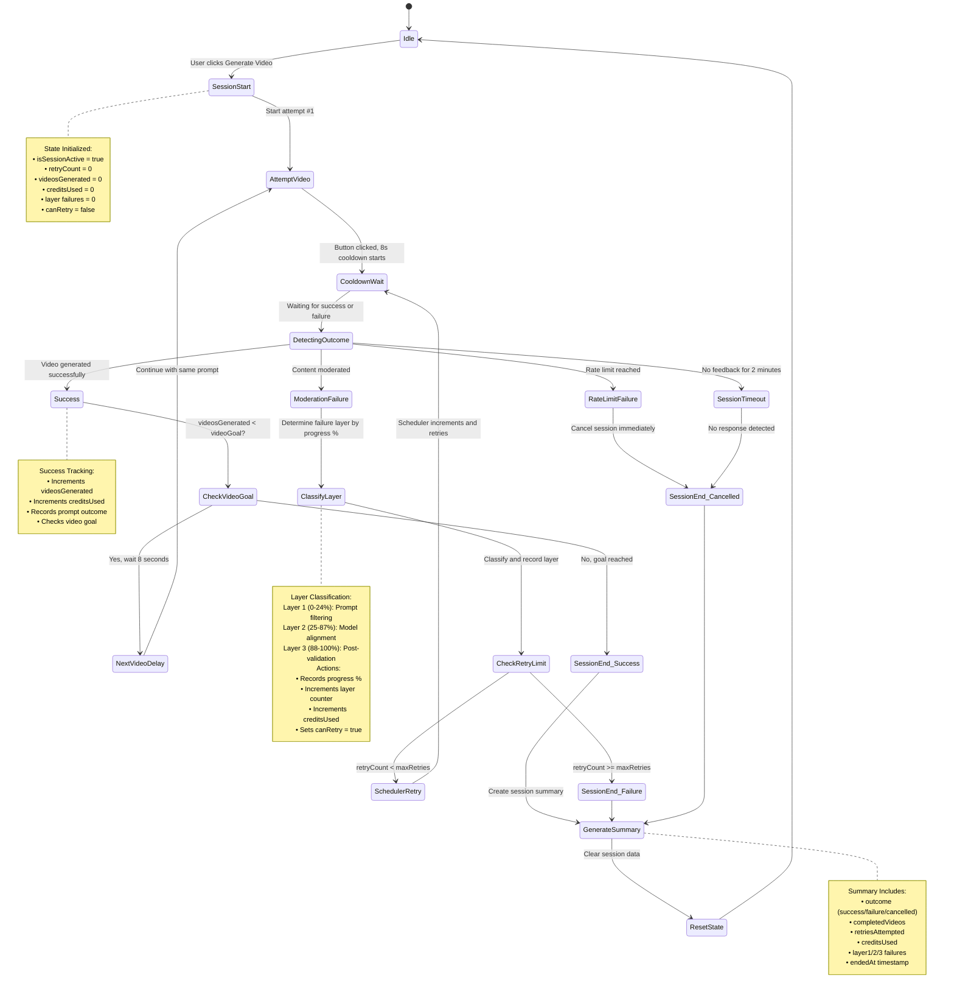

# Video Generation Session Lifecycle

This document describes the complete lifecycle of a video generation session in the Grok Auto-Retry extension, including state management, retry logic, and multi-video generation.

## Overview

The extension manages video generation sessions through a state machine that handles:
- **Session initialization** with prompt capture
- **Automated retries** on moderation failures
- **Multi-video generation** with configurable goals
- **Progress tracking** and failure categorization
- **Session termination** with outcome summaries

## Session Lifecycle State Machine



## Key Components

### Session States

| State | Description |
|-------|-------------|
| **Idle** | No active session; waiting for user action |
| **SessionStart** | Session initialized with prompt and settings |
| **AttemptVideo** | Click attempt in progress |
| **CooldownWait** | 8-second cooldown period after button click |
| **DetectingOutcome** | Monitoring for success or failure signals |
| **NextVideoDelay** | 8-second delay between multi-video generations |
| **SessionEnd** | Terminal state with outcome (success/failure/cancelled) |

### Session Data Structure

```typescript
interface SessionData {
  // Active state
  isSessionActive: boolean;
  retryCount: number;
  videosGenerated: number;
  canRetry: boolean;
  
  // Timing
  lastAttemptTime: number;
  lastFailureTime: number;
  
  // Tracking
  logs: string[];
  attemptProgress: AttemptProgressEntry[];
  creditsUsed: number;
  
  // Failure classification
  layer1Failures: number;  // Prompt filtering (0-24%)
  layer2Failures: number;  // Model alignment (25-87%)
  layer3Failures: number;  // Post-validation (88-100%)
  
  // Outcome
  lastSessionOutcome: SessionOutcome;
  lastSessionSummary: SessionSummary | null;
}

interface PersistentData {
  maxRetries: number;       // Max retry attempts (1-50)
  autoRetryEnabled: boolean;
  lastPromptValue: string;
  videoGoal: number;        // Target videos to generate (1-50)
  videoGroup: string[];     // Related post IDs
  originalMediaId: string | null; // Original image ID for the session
}
```

## Lifecycle Phases

### 1. Session Initialization

**Trigger:** User clicks "Generate Video" button in the extension panel

**Actions:**
1. Capture prompt from site textarea or use stored value
2. Reset session counters (retryCount, videosGenerated, failures)
3. Set `isSessionActive = true`
4. Store session identity (postId/mediaId)
5. **Capture and store original image ID** (`originalMediaId`) for the session
6. Clear video history tracking
7. Initialize progress tracking observer
8. Perform first attempt with `overridePermit = true`

**State Changes:**
```typescript
{
  isSessionActive: true,
  retryCount: 0,
  videosGenerated: 0,
  creditsUsed: 0,
  layer1Failures: 0,
  layer2Failures: 0,
  layer3Failures: 0,
  canRetry: false,
  lastSessionOutcome: 'pending'
}
```

### 2. Video Attempt

**Process:**
1. Write prompt value to site textarea
2. Find and click "Make video" button
3. Record attempt timestamp (keyed by mediaId if present)
4. Start 8-second cooldown timer
5. Begin progress tracking via MutationObserver
6. Reset `canRetry = false` (consumed)

**Guards:**
- Cooldown check: `now - lastClickTime >= 8000ms`
- Permit check: `canRetry === true || overridePermit === true`
- Goal check: `videosGenerated < videoGoal`
- Rate limit: Not in rate-limited state

### 3. Outcome Detection

Two parallel detection mechanisms:

#### A. Success Detection
- **Stream-based:** Monitor GraphQL responses for completed video streams
- **DOM-based:** Fallback polling for video elements in page structure
- **Trigger:** Either mechanism fires `onSuccess()` callback

#### B. Failure Detection
- **Primary:** Toast notification monitoring for "Content Moderated" message
- **Fallback:** Body text scanning
- **Trigger:** Fires `onModerationDetected()` callback

**On Success:**
```typescript
incrementVideosGenerated();
creditsUsed++;

if (videosGenerated >= videoGoal) {
  endSession('success');
} else {
  // Wait 8 seconds, then continue
  setTimeout(() => {
    clickMakeVideoButton(lastPromptValue, { overridePermit: true });
  }, 8000);
}
```

**On Failure:**
```typescript
const progress = parseProgressPercentage(); // From progress button
const layer = classifyLayer(progress);
layer1Failures += (layer === 1) ? 1 : 0;
layer2Failures += (layer === 2) ? 1 : 0;
layer3Failures += (layer === 3) ? 1 : 0;
creditsUsed++;
canRetry = true; // Enable retry permission
```

### 4. Moderation Layer Classification

Progress percentage determines which security layer blocked the video:

| Progress % | Layer | Description |
|------------|-------|-------------|
| 0-24% | **Layer 1** | Prompt Filtering - blocked before generation |
| 25-87% | **Layer 2** | Model-Level Alignment - refused mid-stream |
| 88-100% | **Layer 3** | Post-Generation Validation - blocked after render |

### 5. Retry Scheduling

**Scheduler Loop** (runs every 3 seconds when session active):

```typescript
if (autoRetryEnabled && isSessionActive && canRetry) {
  if (retryCount < maxRetries) {
    if (videosGenerated >= videoGoal) {
      endSession('success');
    } else if (cooldownExpired && hasPermit) {
      retryCount++;
      canRetry = false;
      clickMakeVideoButton(lastPromptValue, { overridePermit: true });
    }
  } else {
    endSession('failure'); // Max retries exceeded
  }
}
```

**Timeout Protection:**
- If no success/failure detected for 2 minutes → `endSession('cancelled')`

### 6. Multi-Video Generation

When `videoGoal > 1`:

1. Each successful video increments `videosGenerated`
2. Session continues until `videosGenerated >= videoGoal`
3. Each video uses the **same prompt** from session start
4. 8-second delay between videos (same as retry cooldown)
5. Retries **do not reset** between videos (applies to whole session)

**Example Flow (videoGoal = 3, maxRetries = 5):**
```
Attempt 1 → Success (1/3) → Wait 8s
Attempt 2 → Failure (1/3, retry 1/5) → Wait 8s
Attempt 3 → Success (2/3, retry 1/5) → Wait 8s
Attempt 4 → Success (3/3) → End session (success)
```

### 7. Session Termination

**Outcomes:**

| Outcome | Trigger |
|---------|---------|
| `success` | Video goal reached |
| `failure` | Max retries exceeded |
| `cancelled` | User cancels, rate limit, or timeout |
| `idle` | Default/clean state |

**Cleanup Actions:**
1. Create session summary with final stats
2. **Clear all video attempts sharing the same originalMediaId** (from grokStream, chrome.storage, and sessionStorage)
3. Reset session flags (`isSessionActive = false`)
4. Clear session counters
5. Clear session identity from window
6. Clear video group chain
7. Stop progress observer
8. Cancel any pending timeouts

**Session Summary:**
```typescript
{
  outcome: 'success',
  completedVideos: 3,
  videoGoal: 3,
  retriesAttempted: 1,
  maxRetries: 5,
  creditsUsed: 4,
  layer1Failures: 0,
  layer2Failures: 1,
  layer3Failures: 0,
  endedAt: 1738512000000
}
```

## State Persistence

### Chrome Storage (chrome.storage.local)
**Persistent across browser sessions:**
- `maxRetries`
- `autoRetryEnabled`
- `lastPromptValue`
- `videoGoal`
- `videoGroup`
- `originalMediaId` - **Original image ID that started the session** (ensures all video attempts reference the same source image)

### Session Storage (sessionStorage)
**Cleared on page refresh:**
- `retryCount`
- `isSessionActive`
- `videosGenerated`
- `canRetry`
- `logs`
- `attemptProgress`
- `creditsUsed`
- `layer1Failures`, `layer2Failures`, `layer3Failures`
- `lastSessionOutcome`
- `lastSessionSummary`

### Window Globals (Debugging)
```typescript
window.__grok_session_post_id    // Current session post ID
window.__grok_session_media_id   // Current session media ID (preserved across videos)
window.__grok_retryState         // Live retry state snapshot (includes originalMediaId)
window.__grok_attempts           // Attempt timestamps by key
window.__grok_canRetry           // Permit flag
```

## Original Image ID Preservation

When generating multiple videos from a single image (videoGoal > 1), it's critical that all video generation attempts reference the **same source image**. The extension ensures this by:

1. **Capturing the original image ID** - When a session starts, the `mediaId` (extracted from the image URL) is stored as `originalMediaId` in persistent storage
2. **Preserving across route changes** - When Grok navigates to new post routes after successful videos, the original `mediaId` is maintained via `window.__grok_session_media_id`
3. **Consistent video generation** - All subsequent video attempts in the session use the stored `originalMediaId`, not the newly detected image from the DOM

This ensures that:
- All videos in a multi-video session are generated from the **same source image**
- The video generation API receives consistent `imageReference` data
- Users can reliably generate variations of videos from a single image
- Session continuity is maintained even when the UI navigates to new pages

## Edge Cases & Guardrails

### Route Changes
- Session identity (postId/mediaId) persists across route changes
- Prompt and settings saved to chrome.storage for continuity
- State migration function available at `window.__grok_migrate_state`

### Cooldown Enforcement
- Single scheduled retry if click attempted during cooldown
- Prevents spam clicks from queuing multiple retries
- Timeout cleared if new click requested

### Duplicate Detection
- Stream success tracking prevents duplicate success callbacks
- Toast text comparison prevents duplicate moderation callbacks
- 5-second minimum between moderation callbacks

### Rate Limits
- Immediate session cancellation on rate limit detection
- No retry attempts when rate limited

### Session Timeout
- 2-minute maximum without feedback
- Auto-cancels to prevent hung sessions

## Integration Points

### Hooks

| Hook | Purpose |
|------|---------|
| `useGrokRetry` | Core session management and state |
| `useSuccessDetector` | Monitors for successful video generation |
| `useModerationDetector` | Monitors for moderation/rate limit notices |
| `useSessionStorage` | Manages persistent and session data |
| `usePageTitle` | Updates page title with session progress |

### Key Functions

| Function | Description |
|----------|-------------|
| `startSession(prompt?)` | Initialize new session |
| `endSession(outcome)` | Terminate session with outcome |
| `clickMakeVideoButton(prompt, options)` | Attempt video generation |
| `markFailureDetected()` | Process moderation failure |
| `incrementVideosGenerated()` | Record successful video |
| `resetRetries()` | Clear retry counter (user action) |

## Debugging

Enable debug logging in the extension panel to see:
- Session lifecycle events
- Retry attempts and cooldowns
- Moderation layer classifications
- Success/failure detection events
- State transitions

Access test bridge:
```javascript
window.__grok_test.startSession()
window.__grok_test.endSession('success')
window.__grok_test.markFailureDetected()
```

## Performance Considerations

- **Scheduler interval:** 3 seconds (balances responsiveness vs CPU)
- **Cooldown period:** 8 seconds (respects platform rate limits)
- **Progress records:** Maximum 25 entries (prevents memory bloat)
- **Log entries:** Maximum 200 lines (auto-truncates oldest)
- **Session timeout:** 2 minutes (prevents zombie sessions)

## Future Enhancements

Potential improvements to the lifecycle:

1. **Adaptive cooldowns** based on success rate
2. **Smart prompt adjustments** after Layer 1 failures
3. **Batch session summaries** across multiple posts
4. **Exponential backoff** for repeated failures
5. **Pre-flight prompt validation** before attempts
