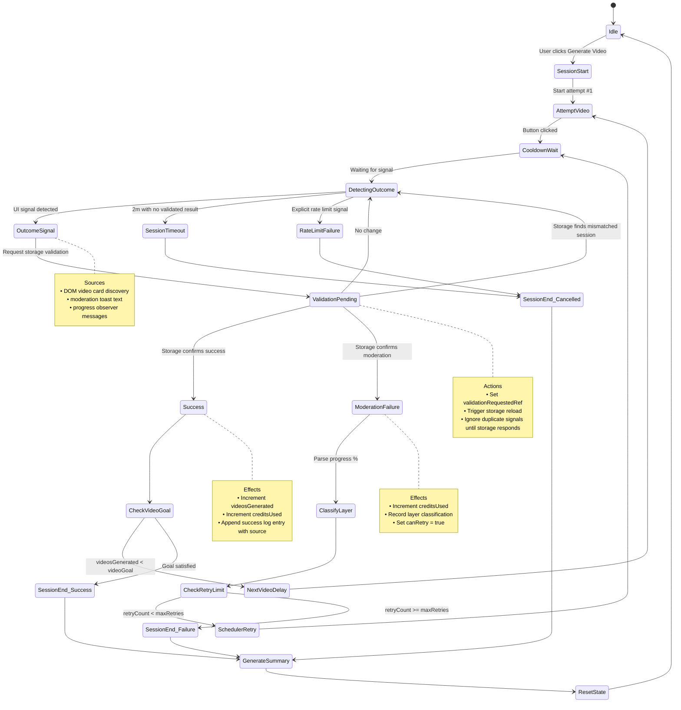

# Video Generation Session Lifecycle v1

This document captures the updated lifecycle for Grok Auto-Retry video generation sessions after introducing storage-backed validation for moderation and success detections. It replaces the direct UI-to-state mutations of v0 with a two-step confirmation flow that keeps retries, counters, and logs aligned with authoritative storage data.

## Overview

The extension still operates as a state machine but now distinguishes between **signals** collected from the UI and **validated outcomes** confirmed from Grok storage. UI-only events request validation instead of mutating state directly, preventing double-counting and race conditions.

Key changes since v0:

- Moderation notices and success cues raised from the DOM now call `requestModerationValidation()` and `requestSuccessValidation()`.
- Storage refreshes produce definitive outcomes (`handleModerationDetected('storage')`, `handleSuccess('storage')`) that update retry counters, credits used, and summaries.
- Console journals and debug logs show both the signal source and the validation request to simplify forensic analysis.

## Session Lifecycle State Machine

## Lifecycle Phases

### 1. Session Initialization

- Session identity (postId, mediaId) and prompt captured.
- Counters reset; `isSessionActive = true`.
- `originalMediaId` preserved in chrome.storage for multi-video continuity.
- Observers and detectors primed with validation-aware callbacks.

### 2. Video Attempt

- Prompt injected into textarea; "Make video" button clicked with overrides when allowed.
- Attempt timestamp recorded and cooldown timer started.
- `canRetry` cleared until a validated moderation or success arrives.

### 3. Outcome Signal Collection

- **Success Signals:**
    - DOM observer polls for rendered video cards and progress completion cues.
- **Moderation Signals:**
  - Toast monitor captures moderation/rate limit notices.
  - Progress observer flags regression across security layers.
- Each signal calls `handleSuccess('ui')` or `handleModerationDetected('ui')` which now immediately delegates to `requestSuccessValidation()` / `requestModerationValidation()`.

### 4. Storage Validation

- Validation functions gate duplicate work via refs and timestamps.
- A storage refresh returns authoritative session state; when new success or moderation entries appear, `handleSuccess('storage')` or `handleModerationDetected('storage')` executes.
- Only storage-confirmed events mutate retry counters, layer tallies, video totals, or summaries.
- If storage shows no change, validation flags reset and detectors continue monitoring.

### 5. Moderation Handling

- Storage-confirmed moderation includes progress percent and layer classification.
- Credits used increment and `canRetry` flips true.
- Scheduler can now authorize the next attempt once cooldown passes and retry limits allow.

### 6. Success Handling

- Storage-confirmed success increments `videosGenerated` and credits used.
- If goal reached, session ends with success summary; otherwise, an 8-second next-video delay primes the subsequent attempt with `overridePermit = true`.

### 7. Retry Scheduling

- Scheduler loop runs every 3 seconds while session active.
- Requires: `autoRetryEnabled`, `canRetry`, cooldown elapsed, under `maxRetries`, and `videosGenerated < videoGoal`.
- Logs include origin tags (e.g., `success[storage]`, `moderation[ui→storage]`) for traceability.

### 8. Session Termination

- Outcomes determined by goal fulfillment, max retries, rate limit, timeout, or manual cancel.
- Summary snapshots now include last validation source and pending flags cleared.
- State reset preserves `originalMediaId` but clears per-session structures.

## State Persistence

Persistence mirrors v0 with the following refinements:

- `sessionStorage` entries include validation flags so in-flight requests do not double-trigger after reloads.
- Debug globals expose `window.__grok_validation` showing last source per outcome type.

| Storage | Key Updates |
| ------- | ----------- |
| chrome.storage.local | `originalMediaId`, `maxRetries`, `videoGoal`, `autoRetryEnabled`, `lastPromptValue` |
| sessionStorage | Retry counters, validation flags, layer tallies, attempt logs, last summary |
| window globals | `__grok_retryState`, `__grok_attempts`, `__grok_validation` for diagnostics |

## Detector Contracts

| Detector | Storage Callback | UI Signal Callback |
|----------|------------------|--------------------|
| Success  | `onStorageSuccess(video)` | `onUISuccessSignal()` -> requests validation |
| Moderation | `onStorageModeration(event)` | `onUIModerationSignal()` -> requests validation |

All detectors now supply a `source` argument so downstream logs distinguish `ui` and `storage` origins.

## Debug Workflow

1. When a UI toast or DOM cue appears, console logs show `requestModerationValidation(ui)` or `requestSuccessValidation(ui)`.
2. Storage poll completes; if new data present, log `handleModerationDetected(storage)` or `handleSuccess(storage)` with outcome details.
3. Scheduler or next-video logic respects `canRetry` and cooldown gates derived from storage-confirmed state.
4. If validation yields no change, logs note `validation:no-change` and detectors resume without altering counters.

## Future Considerations

- Consolidate validation telemetry into session summaries for postmortem analysis.
- Evaluate adaptive polling intervals when multiple validation requests queue rapidly.
- Extend validation pattern to other detectors (rate limits, timeouts) to ensure consistent state provenance.
